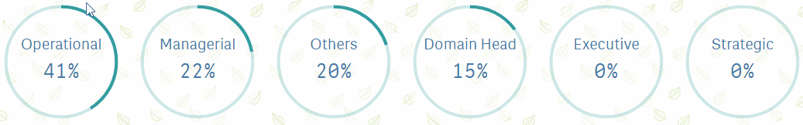

# CircularGauge
<h3>
Settings : 1 Dimension & Measure can be added 
</h3>
<h3>
Measure 
</h3>
<ul>
	<li>Stroke Color : color of stroke (if condition can be used)</li>
</ul>
<h3>
Progress Settings 
</h3>
<ul>
	<li>Qlik Default : like default guage</li>
	<li>Guage Size : Height can be adjusted</li>
	<li>Width : Width can be adjusted</li>
	<li>Header Font Size : Font Size can be adjusted</li>
	<li>Value Font Size : Font Size can be adjusted</li>
	<li>Background Color : Container Background Color can be set</li>
	<li>Header Color : Header Color can be set</li>
	<li>Value Color : Value Colorcan be set</li>
	<li>Animation : Animation can be set (0 is no animation)</li>
	<li>Show Total : Total is visible</li>
	<li>Total Value Color</li>
	<li>Total Value Bg Color</li>
</ul>
<h1>Demo</h1>

